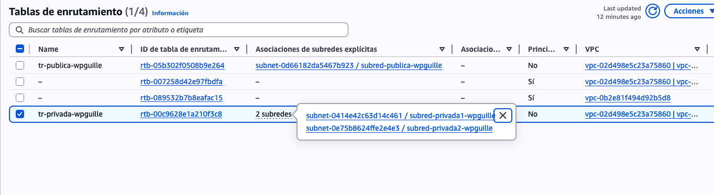
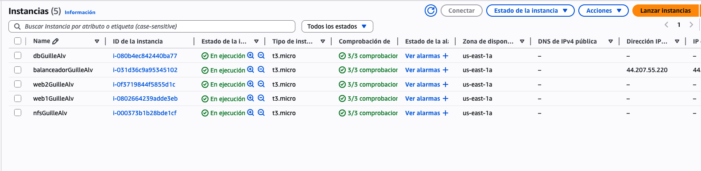
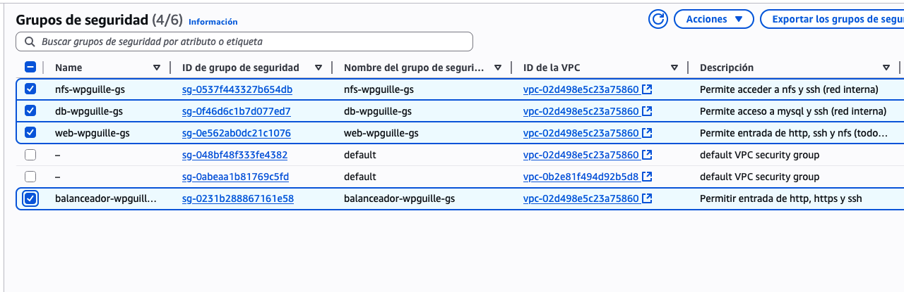
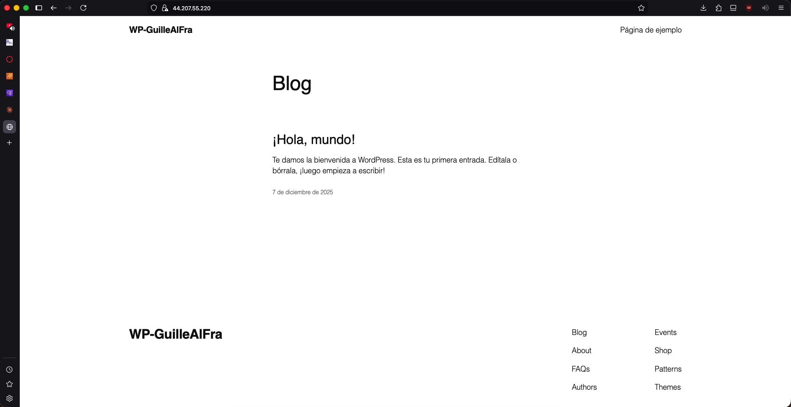
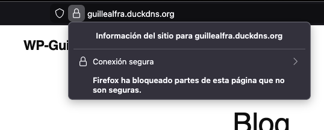
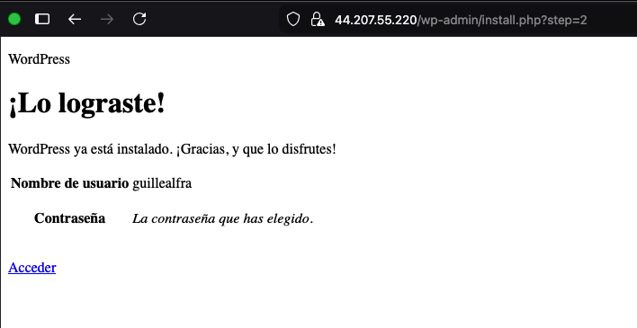
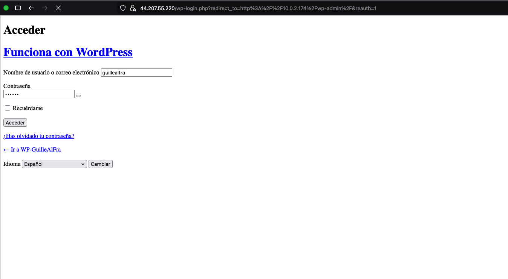
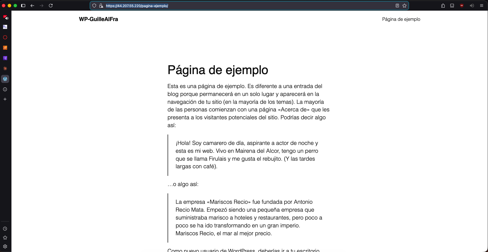

# Despliegue de WordPress en Alta Disponibilidad en AWS

**Autor:** Guillermo Álvarez Franganillo  
**Proyecto:** CMS WordPress escalable en arquitectura de 3 capas

---

## 📋 Índice

1. [Descripción de la Infraestructura](#1-descripción-de-la-infraestructura)
2. [Arquitectura en AWS](#2-arquitectura-en-aws)
3. [Grupos de Seguridad](#3-grupos-de-seguridad)
4. [Proceso de Despliegue](#4-proceso-de-despliegue)
5. [Configuración de Cada Servidor](#5-configuración-de-cada-servidor)
6. [WordPress Personalizado](#6-wordpress-personalizado)
7. [HTTPS + Dominio](#7-https--dominio)
8. [Pruebas Finales](#8-pruebas-finales)
9. [URLs del Proyecto](#9-urls-del-proyecto)

---

## 1. Descripción de la Infraestructura

### Arquitectura de 3 Capas

#### **Capa 1: Capa Pública - Balanceador de Carga**
- Apache configurado como balanceador de carga
- Único punto de entrada desde Internet
- Distribuye tráfico entre servidores backend
- Termina conexiones HTTPS

#### **Capa 2: Capa Privada - Backends + Almacenamiento**
- 2 servidores Apache+PHP (web1 y web2)
- 1 servidor NFS con archivos de WordPress
- Montan sistema de archivos compartido
- Se conectan a la base de datos

#### **Capa 3: Capa Privada - Base de Datos**
- MariaDB Server
- Aislada de la capa pública
- Solo acepta conexiones desde Capa 2

### Comunicación entre Capas

```
Internet → Capa 1 (Balanceador) → Capa 2 (Webs + NFS) → Capa 3 (BD)
```


---

## 2. Arquitectura en AWS

### VPC (Virtual Private Cloud)

VPC personalizada con rango `10.0.0.0/16`

### Subredes

| Subred | CIDR | Tipo | Máquinas |
|--------|------|------|----------|
| subnet-publica | 10.0.1.0/24 | Pública | Balanceador |
| subnet-privada-capa2 | 10.0.2.0/24 | Privada | web1, web2, NFS |
| subnet-privada-capa3 | 10.0.3.0/24 | Privada | Base de datos |


### Tabla de Enrutamiento

#### Route Table: subnet-publica
```
Destino         Target
10.0.0.0/16    local
0.0.0.0/0      igw-xxxxxxxx (Internet Gateway)
```

#### Route Table: subnets privadas
```
Destino         Target
10.0.0.0/16    local
0.0.0.0/0      nat-xxxxxxxx (NAT Gateway)
```



### NAT Gateway

- **Ubicación:** Subred pública (10.0.1.0/24)
- **Elastic IP asociada:** Sí
- Permite a instancias privadas acceder a Internet para actualizaciones

### Internet Gateway

Asociado a la VPC, permite comunicación entre subred pública e Internet.

### Elastic IP

- **IP asignada:** `44.207.55.220`
- **Asociada a:** Balanceador (10.0.1.28)
- **Dominio:** `guillealfra.duckdns.org`

### Instancias EC2

| Nombre | IP Privada | Subred | Security Group | Hostname |
|--------|-----------|--------|----------------|----------|
| Balanceador | 10.0.1.28 | subnet-publica | SG-Balanceador-GuilleAlv | balanceadorGuilleAlv |
| Web1 | 10.0.2.45 | subnet-privada-capa2 | SG-Web-GuilleAlv | web1GuilleAlv |
| Web2 | 10.0.2.174 | subnet-privada-capa2 | SG-Web-GuilleAlv | web2GuilleAlv |
| NFS | 10.0.2.24 | subnet-privada-capa2 | SG-NFS-GuilleAlv | nfsGuilleAlv |
| Base de Datos | 10.0.3.241 | subnet-privada-capa3 | SG-DB-GuilleAlv | dbGuilleAlv |



---

## 3. Grupos de Seguridad

### SG-Balanceador-GuilleAlv

**Inbound:**
| Tipo | Puerto | Origen | Descripción |
|------|--------|--------|-------------|
| HTTP | 80 | 0.0.0.0/0 | Acceso web público |
| HTTPS | 443 | 0.0.0.0/0 | Acceso web seguro |
| SSH | 22 | 0.0.0.0/0 | Administración |

**Outbound:** All traffic → 0.0.0.0/0

### SG-Web-GuilleAlv

**Inbound:**
| Tipo | Puerto | Origen | Descripción |
|------|--------|--------|-------------|
| HTTP | 80 | SG-Balanceador-GuilleAlv | Tráfico desde balanceador |
| SSH | 22 | SG-Balanceador-GuilleAlv | Administración vía bastion |
| NFS | 2049 | SG-NFS-GuilleAlv | Montaje NFS |

**Outbound:** All traffic → 0.0.0.0/0

### SG-NFS-GuilleAlv

**Inbound:**
| Tipo | Puerto | Origen | Descripción |
|------|--------|--------|-------------|
| NFS | 2049 | SG-Web-GuilleAlv | Compartir archivos |
| SSH | 22 | SG-Balanceador-GuilleAlv | Administración |
| MySQL | 3306 | SG-DB-GuilleAlv | Acceso BD |

**Outbound:** All traffic → 0.0.0.0/0

### SG-DB-GuilleAlv

**Inbound:**
| Tipo | Puerto | Origen | Descripción |
|------|--------|--------|-------------|
| MySQL | 3306 | SG-Web-GuilleAlv | Consultas backends |
| MySQL | 3306 | SG-NFS-GuilleAlv | Consultas NFS |
| SSH | 22 | SG-Balanceador-GuilleAlv | Administración |

**Outbound:** All traffic → 0.0.0.0/0



---

## 4. Proceso de Despliegue

### Fase 1: Configuración de Red

1. Crear VPC (10.0.0.0/16)
2. Crear 3 subredes (pública y 2 privadas)
3. Crear y asociar Internet Gateway
4. Crear NAT Gateway en subnet pública
5. Configurar Route Tables y asociarlas

### Fase 2: Seguridad

6. Crear 4 Security Groups específicos
7. Configurar reglas entrada/salida

### Fase 3: Lanzamiento Instancias

8. Lanzar 5 instancias EC2 Debian
9. Asociar a subredes y Security Groups
10. Asignar Elastic IP al balanceador

### Fase 4: Configuración DNS

11. Registrar dominio en DuckDNS: `guillealfra.duckdns.org`
12. Apuntar a Elastic IP: `44.207.55.220`

### Fase 5: Aprovisionamiento

13. Transferir scripts y .pem al balanceador:
```bash
scp -i labsuser.pem labsuser.pem admin@44.207.55.220:~/.ssh/
scp -i labsuser.pem -r ./aws-scripts admin@44.207.55.220:~/
```

14. Distribuir scripts a máquinas privadas desde balanceador

15. Ejecutar scripts en orden:
```bash
# 1. Base de datos (10.0.3.241)
chmod +x db.sh && sudo ./db.sh

# 2. NFS (10.0.2.24)
chmod +x nfs.sh && sudo ./nfs.sh

# 3. Web1 (10.0.2.45)
chmod +x web1.sh && sudo ./web1.sh

# 4. Web2 (10.0.2.174)
chmod +x web2.sh && sudo ./web2.sh

# 5. Balanceador (10.0.1.28)
chmod +x balanceador.sh && sudo ./balanceador.sh
```

### Fase 6: Configuración SSL

16. Instalar certificado con Certbot:
```bash
sudo apt install certbot python3-certbot-apache -y
sudo certbot --apache -d guillealfra.duckdns.org \
  --agree-tos --email galvarezf04@iesalbarregas.es -n
```

### Fase 7: WordPress

17. Acceder a `https://guillealfra.duckdns.org`
18. Completar instalación WordPress
19. Personalizar sitio

---

## 5. Configuración de Cada Servidor

### Balanceador Apache (balanceadorGuilleAlv)

- Apache con módulos: `proxy`, `proxy_http`, `proxy_balancer`, `lbmethod_byrequests`, `ssl`
- Certbot para SSL
- VirtualHost HTTP redirige a HTTPS
- VirtualHost HTTPS balancea entre 10.0.2.45 y 10.0.2.174

### Servidores Web (web1GuilleAlv y web2GuilleAlv)

- Apache + PHP 8.2 con extensiones necesarias
- Cliente NFS (`nfs-common`)
- Montaje NFS persistente en `/etc/fstab`
- DocumentRoot: `/var/www/html` (montaje NFS)
- `mod_rewrite` habilitado, `mod_ssl` habilitado

### Servidor NFS (nfsGuilleAlv)

- `nfs-kernel-server`
- WordPress en `/var/www/html`
- `wp-config.php` configurado con credenciales BD
- Exportación NFS para 10.0.2.45 y 10.0.2.174
- Permisos: `www-data:www-data` (755/644)

### Base de Datos (dbGuilleAlv)

- MariaDB Server 10.11
- `bind-address = 0.0.0.0`
- Base de datos: `wordpress` (utf8mb4)
- Usuario: `wpuser@10.0.2.%`
- Password: `wpPass123`

---

## 6. WordPress Personalizado

**Título del sitio:** "WP-GuilleAlFra"

**Personalización:**
- Contenido con el nombre Guille

**Ubicación archivos:**
- NFS: `/var/www/html` (10.0.2.24)
- Backends: Montado vía NFS
- Base de datos: MariaDB (10.0.3.241)



---

## 7. HTTPS + Dominio

### Dominio

**Dominio:** `guillealfra.duckdns.org`  
**Proveedor:** DuckDNS  
**Registro A:** `44.207.55.220`

### Configuración SSL

**Certificado:** Let's Encrypt (válido)

**Proceso:**
```bash
sudo apt install certbot python3-certbot-apache -y
sudo certbot --apache -d guillealfra.duckdns.org \
  --agree-tos --email galvarezf04@iesalbarregas.es -n
```

Certbot automáticamente:
- Genera certificado SSL
- Modifica configuración Apache
- Configura renovación automática

**Resultado:**
- Puerto 80: Redirige a HTTPS
- Puerto 443: SSL/TLS activo
- Certificado válido por 90 días



---

## 8. Pruebas Finales

### Acceso al Sitio

Acceso a `https://guillealfra.duckdns.org` funcional  
CSS y JavaScript cargando correctamente  
Imágenes visibles  
-------Panel `/wp-admin` presenta problemas de acceso (timeout al iniciar sesión)-------






### Alta Disponibilidad

**Prueba:**
```bash
# Detener Apache en web1
ssh admin@10.0.2.45
sudo systemctl stop apache2

# Acceder al sitio
curl https://guillealfra.duckdns.org
```

Sitio sigue funcionando (tráfico redirigido a web2)

### NFS Compartido

**Prueba:**
```bash
# Crear archivo en NFS
sudo touch /var/www/html/test-nfs.txt

# Verificar en web1 y web2
ls /var/www/html/test-nfs.txt
```

Archivo visible en ambos servidores

### Conectividad

**Balanceador → Backends:**
```bash
curl http://10.0.2.45  # Conecta
curl http://10.0.2.174  # Conecta
```

**Backends → Base de datos:**
```bash
mysql -h 10.0.3.241 -u wpuser -pwpPass123 -e "SELECT 1"  # Conecta
```

**Backends → NFS:**
```bash
showmount -e 10.0.2.24  # Muestra exportaciones
```

### Seguridad

**Desde Internet a IPs privadas:**
```bash
curl http://10.0.2.45  # Timeout - inaccesible
curl http://10.0.3.241:3306  # Timeout - inaccesible
```

Solo el balanceador es accesible públicamente

---

## 9. URLs del Proyecto

### Repositorio GitHub
`https://github.com/guillealfra/aws_scripts_wp`

### Sitio WordPress
`https://guillealfra.duckdns.org`

---

## 10. Conclusiones

Arquitectura de alta disponibilidad implementada exitosamente:

Separación en 3 capas  
Alta disponibilidad con 2 backends  
Almacenamiento compartido NFS  
Seguridad con Security Groups  
HTTPS con certificado válido  
Dominio público funcional  
Aprovisionamiento automatizado  

---

**Guillermo Álvarez Franganillo**
**Diciembre 2025**  
**IES Albarregas**
